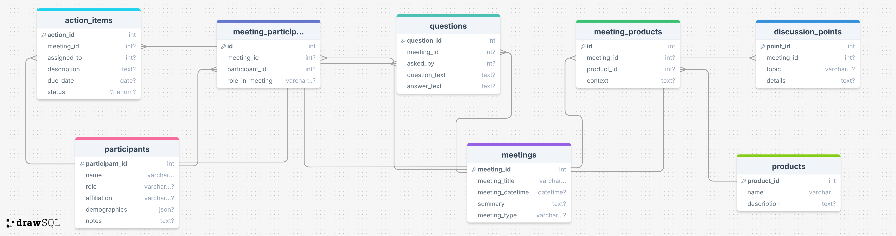

# User Interviews Database with ChatGPT Integration

A Node.js server with MySQL database for managing user interview data, featuring a ChatGPT integration for querying the database using natural language.

## Schema

## Example Question & Response

**Question**: How many meetings have been conducted?

**Answer**: "There are 4 meetings in the database. These meetings cover a range of topics from product discovery interviews to feature demos and strategic planning sessions. Each meeting involved different participants and discussions tailored to their specific agendas."

**Other example questions:**

- What are the main pain points discussed in the meetings?
- Who are the participants and what are their roles?
- What action items are still pending?
- Which products were mentioned most frequently?
- What insights can you provide about user experience feedback?

## Prompting Strategies

To ensure optimal reponse quality, I included this clarification in my prompt:

"IMPORTANT: Use the actual data provided above to answer questions. Do NOT suggest SQL queries. Provide direct answers with specific numbers, names, and insights from the actual data. Be conversational and insightful, not technical."

This addition made the responses much more consistent and helpful.
